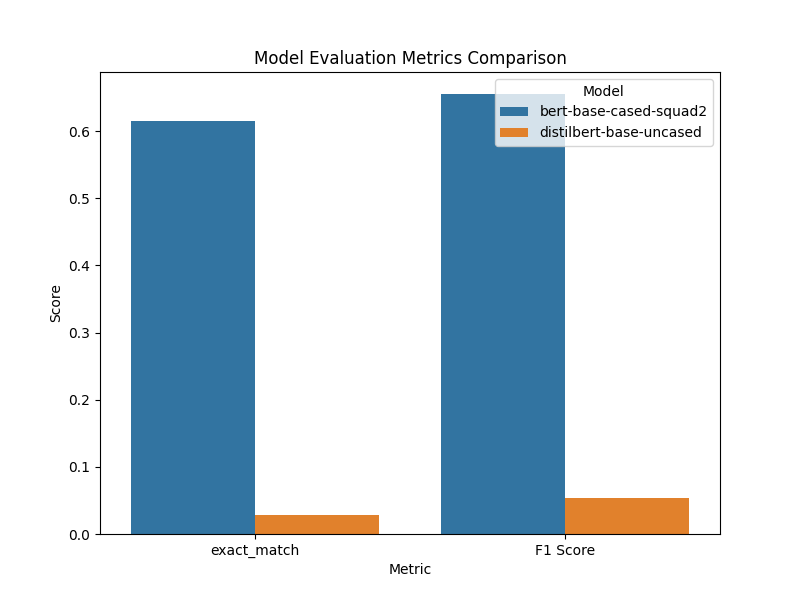
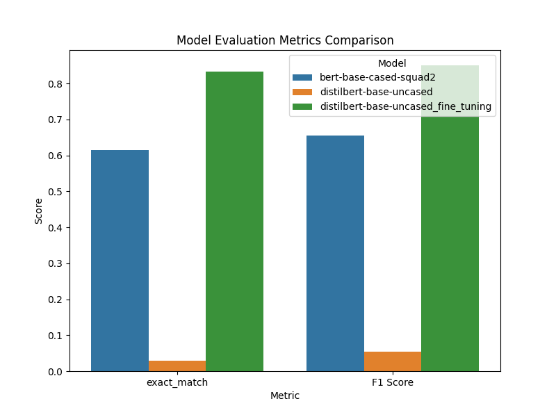

# Fine-tuning QA Language Model on SQuAD dataset
Compare two pre-trained Language Models on SQuAD evaluation metrics before and after fine-tuning.
This repo also contains creating UI for QA Inference application via streamlit

## Features
- LM.py contains relevant functions for pre-processing dataset, creating DataLoader, loading models, and computing metrics
- app.py contains adding UI for the QA Inference application via streamlit

## QA Models Performance Evaluation Before Fine-tuning

## QA Models Performance Evaluation After Fine-tuning

